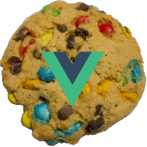

<p align="center">
  
</p>

# 

- __Lead Maintainer:__ [David Roche][Lead]


Vue cookie notification is a simple way to add cookie notice to your website
to comply with EU law. The main functionality still has to be added :) 

- Post a [github issue][Issue],


## Install
To install via npm,

```
install vue-cookie-notification
```

## Quick Example


```html
<template>
  <div id="app">
    <cookie :cookietext="cookietext" :cookiebutton="cookiebutton" :cookietextcolor="cookietextcolor"
    :cookietextsize="cookietextsize" :cookiebackgroundcolor="cookiebackgroundcolor" :cookiename="cookiename" :cookievalue="cookievalue" :cookieexdays="cookieexdays" ></cookie>
  </div>
</template>
```

```js

import cookie from 'vue-cookie-notification';

export default {
  name: 'app',
  components: {
    cookie
  },
  data () {
    return {
      cookietext:'In order to give you the best experience, our website eats cookies. By continuing to use this site, you agree to our diet of cookies.',
      cookiebutton:'feed me',
      cookietextcolor:'green',
      cookietextsize:'20px',
      cookiebackgroundcolor:'orange',
      cookiename:'VUECOOKIE',
      cookievalue:'12345',
      cookieexdays:365,


    }
  }
}
```

```css
<style>

</style>

```

## Contributing

If you feel you can help in any way, be
it with bug reporting, documentation, examples, extra testing, or new features feel free
to [create an issue][Issue], or better yet, [submit a [Pull Request][Pull]. 


[Issue]: https://github.com/davidwroche/vue-cookie-notification/issues
[Lead]: https://github.com/davidwroche
[Npm]: https://www.npmjs.com/package/vue-cookie-notification
[Pull]: https://github.com/davidwroche/vue-cookie-notification/pulls
